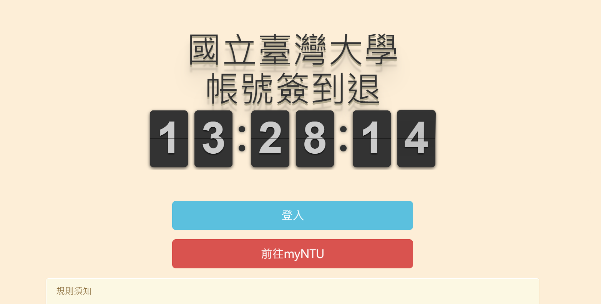
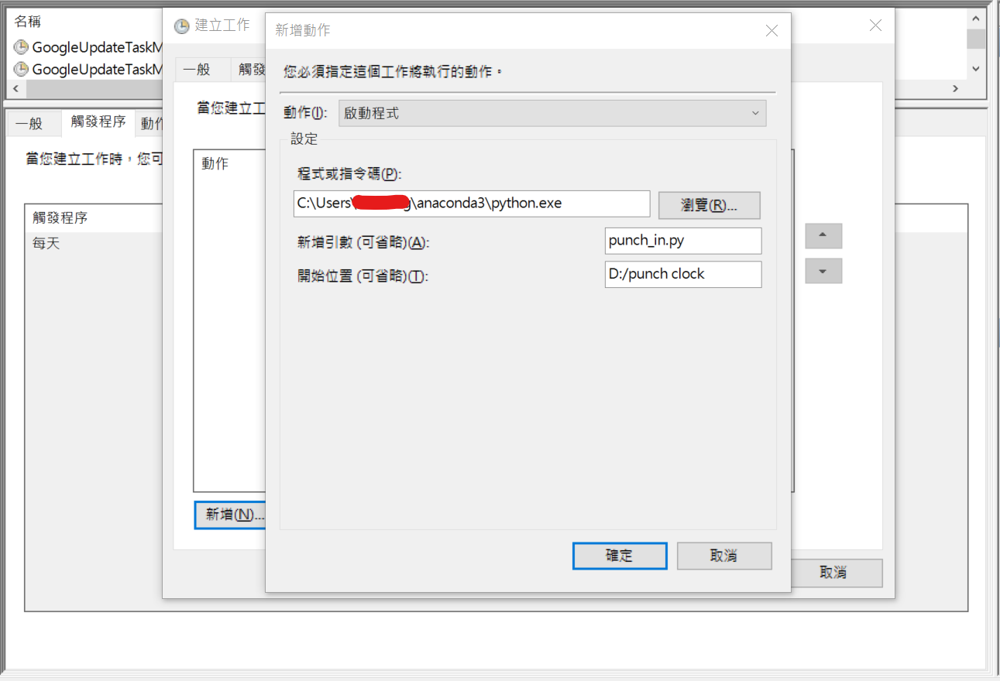

# Punch clock

## Selenium NTU attendance system auto sign in/out program. 

## Installation:

1. Clone or download this repo.

2. pip install **Selenium**.

3. Download **Chromdriver** and put into the repo dir.

4. Change the **account**, **password** in the **punch_in.py**.  

### Task schedule:
### Windows 10
1. Open **Start**.
2. Search for**Task schedule**, click the top result
3. select the **New Folder option** and type the name for the folder. For example, Punch in.
4. Click the **OK**
5. Select the **Action** page, in the **Program/script** field, specify the path for **python.exe**.
6. In the **Add argumemts(optional)** field, type the **punch_in.py**.
7. In the **Start in**, type the "the path folder for the punch_in.py"
9. Click the **OK**

