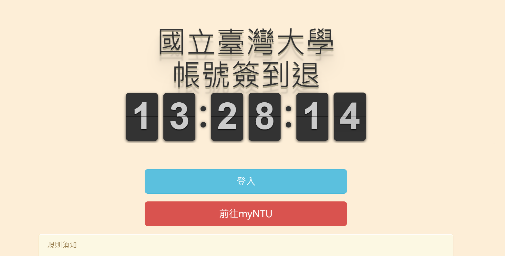

# punch clock

Selenium NTU attendance system auto sign in/out program. 

Installation:

1. Clone or download this repo.

2. pip install Selenium

3. Download Chromdriver and put into the repo dir.

4. Change the student_id, student_pw, work_name, work_inf in the config.json.